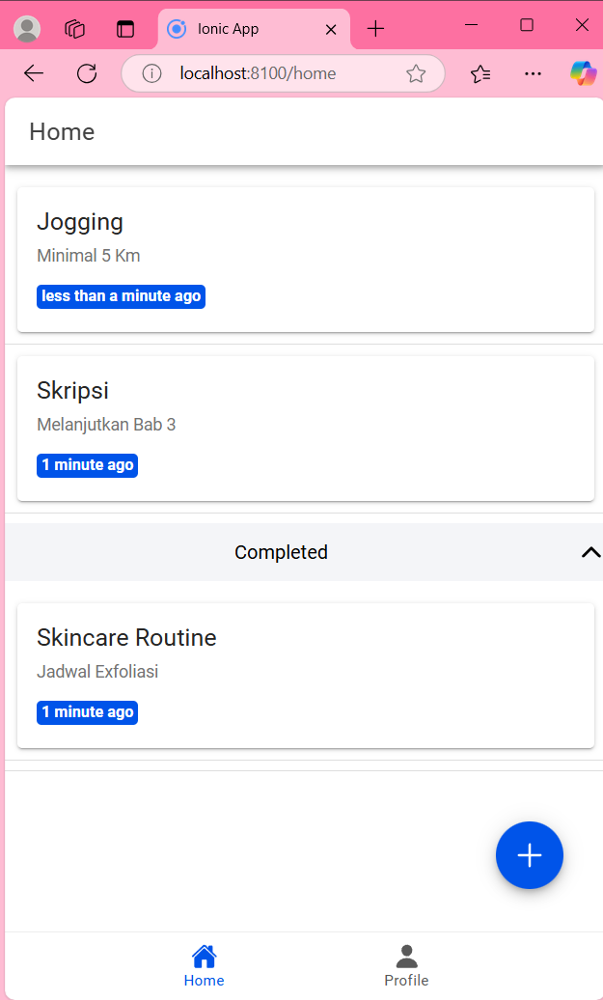
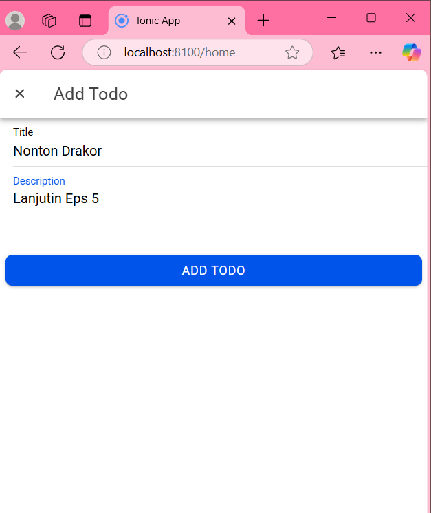
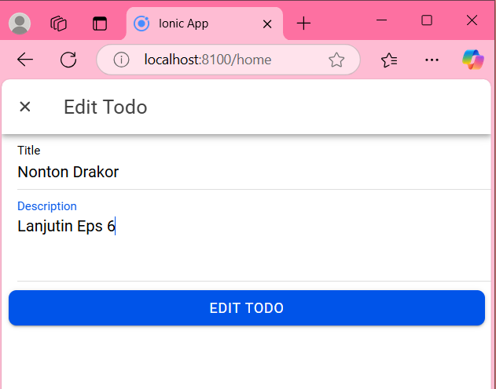
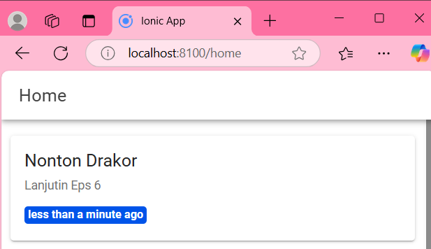
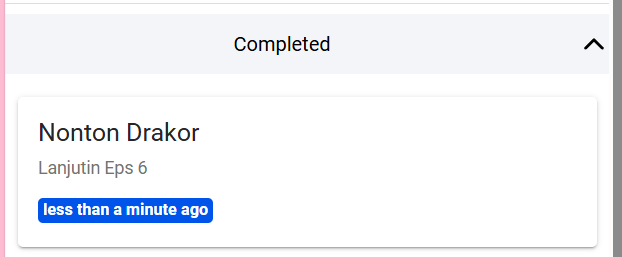
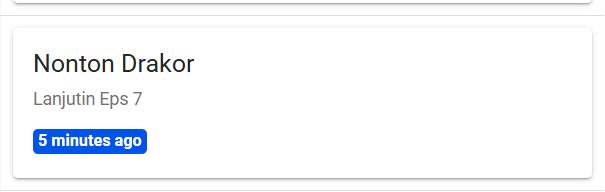

# LabMobile10_SyadinaZufarin_Vue-Firebase_Shift-F

Kode Source Code lengkap : https://drive.google.com/file/d/12nQO-mZVlxwFWIecuX7ogrOiMPktlCD_/view?usp=sharing

Melanjutkan tampilan vue-firebase yang dibuat sebelumnya, ada beberapa fitur yang ditambahkan dalam aplikasi ini yaitu To Do. 
To Do berguna untuk membuat jadwal atau catatan kegiatan yang akan kita lakukan. Dalam hal ini saya sudah membuat beberapa To Do dalam aplikasi ini. 
To do yang saya buat yakni rencana untuk jogging, skripsi serta jadwal skincare routine yang sudah saya mark sebagai to do completed.

Selanjutnya, dalam aplikasi ini kita juga dapat menambahkan rencana atau to do yang lain dengan menekan button '+' yang terletak dibawah aplikasi ini. 
Saya mencoba menambahkan satu To Do dalam aplikasi ini yaitu "Nonton Drakor".

Dan berhasil ditambahkan dalam halaman tampilan to do saya. Jika berhasl menambahkan suatu to do maka akan muncul suatu alert "Todo added succesfully"

Selain itu, kita juga dapat melakukan edit pada rencana yang kita buat dengan melakukan swipe ke kiri maka akan muncul button edit dengan logo pena dan berlatar biru.
Saya mencoba melakukan edit pada to do yang sudah saya buat sebelumnya yaitu "Nonton Drakor" sebelumnya pada deskripsi tertulis "lanjutin eps 5" dengan edit ini saya akan mengubahnya menjadi "lanjutin eps 6"

Dan berhasil di edit. Jika edit berhasil maka akan muncul alert "To Do updated succesfully"

Terakhir, kita dapat menandai bahwa to do yang kita buat sudah selesai dengan melakukan swipe ke kiri maka akan muncul button berwarna hijau dengan logo centang yang dapat kita klik  untuk memindahkan to do kita kedalam kelompok to do yang sudah selesai atau complete bersamaan dengan adanya alert "Todo marked as complete". Saya mencoba untuk menambahkan to do "Nonton Drakor" sebagai to do yang sudah selesai atau complete dan berhasil.

Jika kita ingin mengaktifkan kembali to do yang sudah kita selesaikan maka kita dapat melakukan swipe ke kiri pada bagian to do yang sudah complete dan akan muncul button berwarna orange dengan logo silang yang akan mengaktifkan kembali to do yang sudah selesai, selain itu akan muncul alert bertuliskan " Todo marked as active". Saya mencoba mengaktifkan kembali To Do "Nonton Drakor" yang sebelumnya sudah saya marked sebagai to do complete dan berhasil.

